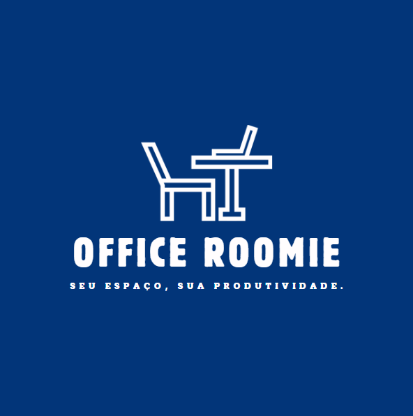

# Office Roomie

 

`Análise e Desenvolvimento de Sistemas`

`Projeto: Desenvolvimento de uma Aplicação Interativa`

`Eixo 2`

Este projeto tem como objetivo desenvolver um sistema eficiente e intuitivo para a reserva de salas em espaços de coworking, tanto para uso coletivo quanto para trabalho individual. O sistema permitirá que usuários realizem reservas em tempo real, verificando a disponibilidade de salas, escolhendo o ambiente que melhor atenda às suas necessidades e efetuando pagamentos de forma segura. O projeto também incluirá funcionalidades como a gestão de reservas e notificações automáticas visando otimizar a utilização dos espaços e melhorar a experiência dos usuários.

## Integrantes

* Brena Aparecida Ferreira
* Caio de Souza Araujo
* Farley Rodrigues De Souza
* Fernando Vinicius Sousa Moura
* Kevin Lucas Andrade Dos Santos
* Marcelly Thais Freitas Neves

## Orientador

* Bernardo Jeunon de Alencar

## Instruções de utilização

Assim que a primeira versão do sistema estiver disponível, deverá complementar com as instruções de utilização. Descreva como instalar eventuais dependências e como executar a aplicação.

Não deixe de informar o link onde a aplicação estiver disponível para acesso (por exemplo: https://adota-pet.herokuapp.com/src/index.html).

Se houver usuário de teste, o login e a senha também deverão ser informados aqui (por exemplo: usuário - admin / senha - admin).

O link e o usuário/senha descritos acima são apenas exemplos de como tais informações deverão ser apresentadas.

# Documentação

<ol>
<li><a href="docs/01-Documentação de Contexto.md"> Documentação de Contexto</a></li>
<li><a href="docs/02-Especificação do Projeto.md"> Especificação do Projeto</a></li>
<li><a href="docs/03-Metodologia.md"> Metodologia</a></li>
<li><a href="docs/04-Projeto de Interface.md"> Projeto de Interface</a></li>
<li><a href="docs/05-Arquitetura da Solução.md"> Arquitetura da Solução</a></li>
<li><a href="docs/06-Template Padrão da Aplicação.md"> Template Padrão da Aplicação</a></li>
<li><a href="docs/07-Programação de Funcionalidades.md"> Programação de Funcionalidades</a></li>
<li><a href="docs/08-Plano de Testes de Software.md"> Plano de Testes de Software</a></li>
<li><a href="docs/09-Registro de Testes de Software.md"> Registro de Testes de Software</a></li>
<li><a href="docs/10-Plano de Testes de Usabilidade.md"> Plano de Testes de Usabilidade</a></li>
<li><a href="docs/11-Registro de Testes de Usabilidade.md"> Registro de Testes de Usabilidade</a></li>
<li><a href="docs/12-Apresentação do Projeto.md"> Apresentação do Projeto</a></li>
<li><a href="docs/13-Referências.md"> Referências</a></li>
</ol>

# Código

<li><a href="src/README.md"> Código Fonte</a></li>

# Apresentação

<li><a href="presentation/README.md"> Apresentação da solução</a></li>
