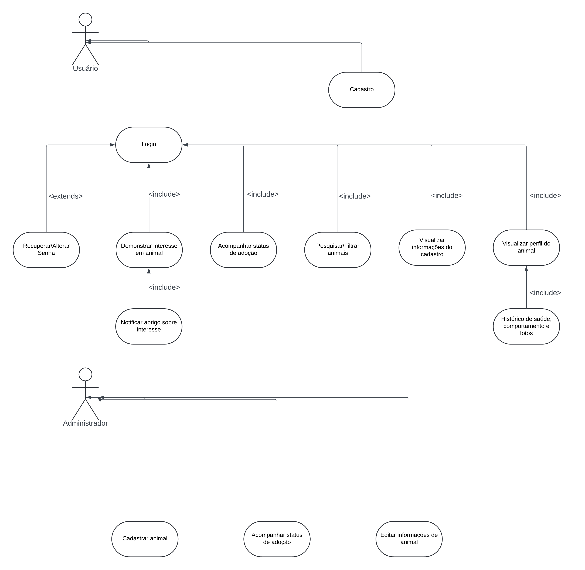

# Especificações do Projeto

Definição do problema e ideia de solução a partir da perspectiva do usuário. É composta pela definição do  diagrama de personas, histórias de usuários, requisitos funcionais e não funcionais além das restrições do projeto.

Apresente uma visão geral do que será abordado nesta parte do documento, enumerando as técnicas e/ou ferramentas utilizadas para realizar a especificações do projeto

## Personas

| João Silva    |                                    |                |
|--------------------|------------------------------------|----------------------------------------|
||**Idade:** 60 anos - **Ocupação:**  Designer Gráfico |Aplicativos: Facebook, Whatsapp, Instagram.|
|**Descrição:** João mora em um apartamento e está à procura de um animal de estimação para adoção. Ele prefere cães de porte médio e está preocupado com questões como o comportamento do animal e a compatibilidade com seu estilo de vida. Tem pouca experiência com adoção e busca informações sobre cuidados com animais. |**Necessidades:** Por trabalhar durante quase todo dia, Juliana não consegue acompanhar horários regulares de coleta reciclável em seu bairro, tornando-se assim inviável faltar em seu trabalho para depositar o lixo em um local ideal.|**Objetivos:** Adotar um animal compatível com seu estilo de vida e acessar uma área informativa com dicas sobre cuidados e adoção.| 

| Maria Fernandes   |                                    |                |
|--------------------|------------------------------------|----------------------------------------|
||**Idade:** 45 anos - **Ocupação:**  Responsável por um abrigo de animais |Aplicativos: Facebook, Whatsapp, Instagram.|
|**Descrição:** Maria administra um abrigo para animais abandonados. Ela é responsável por gerenciar os perfis dos animais no sistema, cadastrar novos animais e responder aos interessados em adoção. Tem pouco tempo disponível e busca um sistema que facilite o gerenciamento das informações e a comunicação com os adotantes. |**Necessidades:** Cadastrar e editar informações sobre os animais disponíveis, receber notificações quando alguém demonstrar interesse em um animal e facilitar a comunicação com adotantes.|**Objetivos:** Promover a adoção dos animais de maneira rápida e eficiente e gerenciar o abrigo e as informações dos animais de forma simples.| 

## Histórias de Usuários

Com base na análise das personas forma identificadas as seguintes histórias de usuários:

|EU COMO... `PERSONA`| QUERO/PRECISO ... `FUNCIONALIDADE` |PARA ... `MOTIVO/VALOR`                 |
|--------------------|------------------------------------|----------------------------------------|
| Jõao Silva| cadastrar-me no site | conseguir acesso a plataforma para adotar.      |
| Jõao Silva| realizar login no site    | conseguir adotar.      |
| Maria Fernandes| cadastrar-me no site | conseguir acesso a plataforma e  mostrar os animais disponiveis.    |
| Maria Fernandes| realizar login no site | conseguir disponibilizar os animais para adoção.   |
| Usuário | visualizar minhas informações cadastradas   |   possibilitar o acesso as minhas informações.    |
| Jõao Silva / Maria Fernandes | de um filtro de busca personalisado       | encontrar rapidamente um animal que atenda às minhas preferências.            |
| Maria Fernandes  | cadastrar animais para adoção    |  possibilitar a adoção dos animais disponíveis e cadastrados       |
| Maria Fernandes  | editar as informações dos meus animais cadastrados |  possibilitar a edição de informações e cadastro.     |
| Jõao Silva| conseguir visualizar os animais disponíveis para adoção e suas caracteristicas   |  conseguir escolher a melhor opção para adoção.      |
| Maria Fernandes| receber notificações quando alguém demonstrar interesse no meu animal cadastrado  |  conseguir contato com o interessado e sanar possiveis dúvidas sobre o animal e a adoção.     |
|  Jõao Silva | demonstrar interesse no animal atráves de um formulário   |  possibilitar o dono de abrigo de animais saber do interesse na adoção.     |
| Usuário | de uma área informativa com conteúdos sobre cuidados com animais e dicas de adoção. |  aumentar o conhecimento sobre o assunto.  |

## Requisitos

As tabelas que se seguem apresentam os requisitos funcionais e não funcionais que detalham o escopo do projeto.

### Requisitos Funcionais

|ID    | Descrição do Requisito  | Prioridade |
|------|-----------------------------------------|----|
|RF-001| O sistema deve possibilitar ao usuário fazer login, se cadastrar ou alterar sua senha. | ALTA |
|RF-002| O sistema deve permitir ao usuário verificar as informações registradas no cadastro, após fazer seu login. | ALTA |
|RF-003| O sistema deve fornecer feedback claro para ações do usuário, como confirmações de formulários e mensagens de erro. | ALTA |
|RF-004| O sistema deve permitir cadastrar animais disponíveis para adoção. | ALTA |
|RF-005| O Sistema deve permitir editar as informações dos animais cadastrados. | MEDIA |
|RF-006| O sistema deve ter uma página de perfil detalhada para cada animal como: histórico de saúde, comportamento, características específicas e fotos. | MEDIA |
|RF-007| O sistema deve oferecer uma funcionalidade de filtro/pesquisa para permitir ao usuário localizar os animais. | ALTA |
|RF-008| O sistema deve permitir o adotante/usuário demonstrar interesse em um animal. | ALTA |
|RF-009| O sistema deve notificar ao abrigo quando um usuário demonstrar interesse em um animal cadastrado. | ALTA |
|RF-010| O sistema deve facilitar o contato com a instituição  | MEDIA |

### Requisitos não Funcionais

|ID     | Descrição do Requisito  |Prioridade |
|-------|-------------------------|----|
|RNF-001| A aplicação deve ser publicada em um ambiente acessível publicamente na Internet (Repl.it, GitHub Pages, Heroku). | ALTA |
|RNF-002| A aplicação deve ser responsiva, tendo boas exibições em diversos tamanhos de tela. Como em tablets, celulares e computadores. | ALTA |
|RNF-003| O código-fonte deve ser de fácil compreensão e seguir as convenções de codificação estabelecidas pela equipe de desenvolvimento. Isso inclui a utilização de comentários claros e descritivos, nomes de variáveis e funções significativos, e a aderência a um estilo de codificação consistente que é documentado e compartilhado entre a equipe. | ALTA |
|RNF-004| A aplicação deve ser compatível com os principais navegadores do mercado (Google Chrome, Firefox, Microsoft Edge). | ALTA |
|RNF-005| O sistema deve implementar políticas de senha robustas, incluindo requisitos de complexidade, Como um mínimo de 8 caracteres, com pelo menos uma letra maiúscula, uma letra minúscula, um número e um caractere especial. | ALTA |

## Restrições

As questões que limitam a execução desse projeto e que se configuram como obrigações claras para o desenvolvimento do projeto em questão são apresentadas na tabela a seguir.

|ID| Restrição                                             |
|--|-------------------------------------------------------|
|01| O projeto deverá ser entregue até o final do semestre létivo. |
|02| O sistema deverá ser desenvolvido utilizando apenas tecnologias open-source ou ferramentas com licenciamento gratuito.  |
|03| A equipe não pode subcontratar o desenvolvimento do trabalho.      |

## Diagrama de Casos de Uso

O diagrama de casos de uso é o próximo passo após a elicitação de requisitos, que utiliza um modelo gráfico e uma tabela com as descrições sucintas dos casos de uso e dos atores. Ele contempla a fronteira do sistema e o detalhamento dos requisitos funcionais com a indicação dos atores, casos de uso e seus relacionamentos. 

