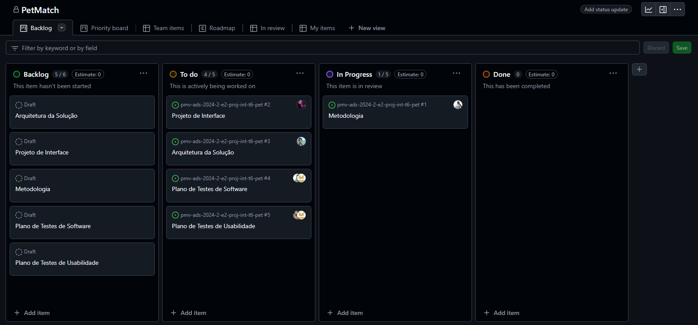

# Metodologia

## Gerenciamento de Projeto

A metodologia escolhida para o gerenciamento e desenvolvimento deste projeto foi a ágil. Dentre as metodologias ágeis existentes no mercado, escolhemos a mais usada atualmente que é o SCRUM.
Foi escolhida essa metodologia pois, as práticas do Scrum permitem que as equipes promovam o autogerenciamento, aprendam com base nas experiências e se adaptem às mudanças.
Além de solucionar problemas complexos de maneira econômica e sustentavel.

### Divisão de Papéis

A divisão de papéis do grupo baseada na divisão do SCRUM (Scrum Master, Product Owner e Equipe de Desenvolvimento) ficou da seguinte forma:
<ul>
<li>Scrum Master: Rodrigo Amorim;</li>
<li>Product Owner: Danilo Oliveira;</li>
<li>Equipe de Desenvolvimento: Rodrigo Amorim, Fabio Luiz, Laise Farias France, Italo de Souza Pereira, Danilo Oliveira e César Ribeiro.</li>
</ul>

### Processo

Para organização e distribuição das tarefas do projeto, a equipe está utilizando o GitHub, estruturado com as seguintes listas:
<ul>
<li>Product Backlog: recebe as tarefas a serem trabalhadas e representa o Backlog do produto. Todas as atividades identificadas no decorrer do projeto são incorporadas a esta lista. </li>
<li>To do: esta lista representa o Sprint Backlog que está sendo trabalhado.</li>
<li>In progress: lista das tarefas iniciadas.</li>
<li>Done: nesta lista são colocadas as tarefas finalizadas.</li>
</ul>
O quadro kanban do grupo no GitHub está presente no link: https://github.com/orgs/ICEI-PUC-Minas-PMV-ADS/projects/1445  e esta apresentado no estado atual da seguinte forma:
<figure>
    
    <figcaption> Figura 1 - Tela do kanban do GitHub utilizada pelo grupo</figcaption>
</figure>

## Controle de Versão

A ferramenta de controle de versão adotada no projeto foi o
[Git](https://git-scm.com/), sendo que o [Github](https://github.com)
foi utilizado para hospedagem do repositório.

O projeto segue a seguinte convenção para o nome de branches:

- `main`: versão estável já testada do software
- `unstable`: versão já testada do software, porém instável
- `testing`: versão em testes do software
- `dev`: versão de desenvolvimento do software

Quanto à gerência de issues, o projeto adota a seguinte convenção para
etiquetas:

- `documentation`: melhorias ou acréscimos à documentação
- `bug`: uma funcionalidade encontra-se com problemas
- `enhancement`: uma funcionalidade precisa ser melhorada
- `help wanted`: funcionalidade precisa de atenção extra.

### Ferramentas

As ferramentas empregadas no projeto são:

- Editor de código.
- Ferramentas de comunicação
- Ferramentas de desenho de tela (_wireframing_)

O editor de código foi escolhido porque ele possui uma integração com o
sistema de versão. As ferramentas de comunicação utilizadas possuem
integração semelhante e por isso foram selecionadas. Por fim, para criar
diagramas utilizamos essa ferramenta por melhor captar as
necessidades da nossa solução.

Os artefatos do projeto são desenvolvidos a partir das plataformas GitHub apresentadas com seu propósito na tabela que se segue.
| AMBIENTE | PLATAFORMA |LINK DE ACESSO                 |
|--------------------|--------------------------------------------------------------------------------|----------------------------------------|
|Repositório de código fonte | GitHub |  |
|Documentos do projeto  | GitHub | https://github.com/ICEI-PUC-Minas-PMV-ADS/pmv-ads-2024-2-e2-proj-int-t6-pet/tree/main/docs |
|Gerenciamento do projeto  | GitHub | https://github.com/orgs/ICEI-PUC-Minas-PMV-ADS/projects/1445 |
|Projeto de interface e wireframes  | MarvelApp | |
