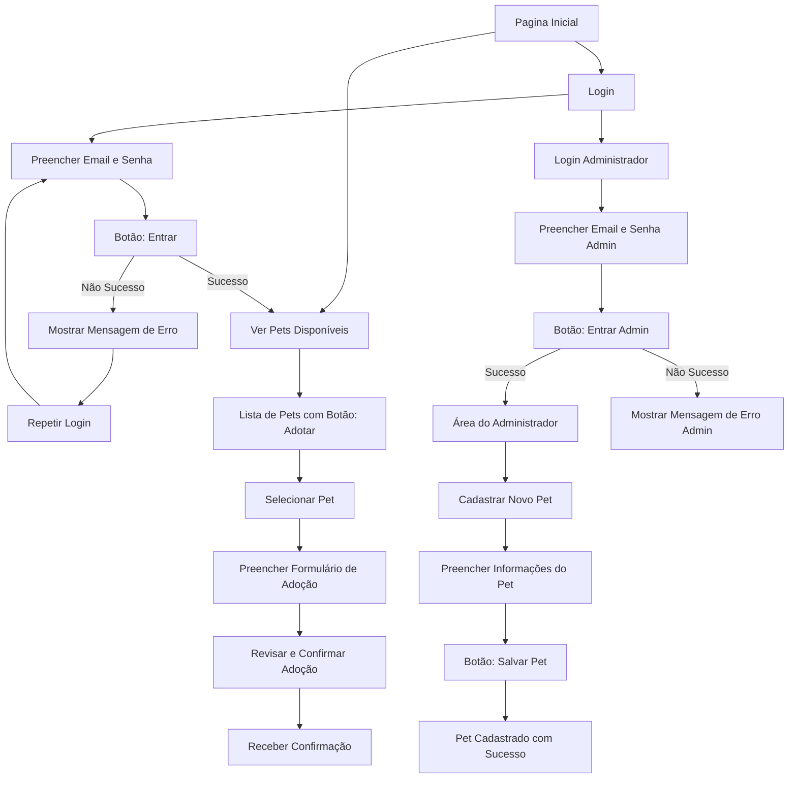

# Projeto de Interface

Pré-requisitos: <a href="2-Especificação do Projeto.md"> Documentação de Especificação</a>

Visão geral da interação do usuário pelas telas do sistema e protótipo interativo das telas com as funcionalidades que fazem parte do sistema (wireframes).

## Diagrama de Fluxo

# Wireframes do Fluxo de Adoção de Pets

## 1. Página Inicial
- **Elementos:**
  - **Título:** "Bem-vindo ao PetMatch"
  - **Botões:**
    - Login
    - Cadastro
    - Ver Pets Disponíveis

---

## 2. Tela de Login
- **Elementos:**
  - **Título:** "Login"
  - **Campos:**
    - **Email** (Campo de texto)
    - **Senha** (Campo de texto com ocultação)
  - **Botão:**
    - Entrar
  - **Link:**
    - Esqueceu a Senha?

- **Mensagens:**
  - Mensagem de erro abaixo do botão se o login falhar: "Email ou senha incorretos."

---

## 3. Tela de Cadastro
- **Elementos:**
  - **Título:** "Cadastro"
  - **Campos:**
    - **Nome** (Campo de texto)
    - **Email** (Campo de texto)
    - **Senha** (Campo de texto com ocultação)
    - **Confirmar Senha** (Campo de texto com ocultação)
  - **Botão:**
    - Registrar

- **Mensagens:**
  - Mensagem de erro abaixo do botão se os dados forem inválidos: "Verifique os campos e tente novamente."

---

## 4. Tela de Ver Pets Disponíveis
- **Elementos:**
  - **Título:** "Pets Disponíveis"
  - **Lista de Pets:**
    - **Pet 1**
      - Imagem do pet
      - Nome do pet
      - **Botão:** Adotar
    - **Pet 2**
      - Imagem do pet
      - Nome do pet
      - **Botão:** Adotar

---

## 5. Tela de Seleção de Pet
- **Elementos:**
  - **Título:** "Selecionar Pet"
  - Imagem do pet selecionado
  - Nome do pet
  - **Botão:** Próximo

---

## 6. Formulário de Adoção
- **Elementos:**
  - **Título:** "Formulário de Adoção"
  - **Campos:**
    - **Nome Completo** (Campo de texto)
    - **Endereço** (Campo de texto)
    - **Telefone** (Campo de texto)
    - **Observações** (Campo de texto longo)
  - **Botão:** Enviar Adoção

---

## 7. Tela de Confirmação
- **Elementos:**
  - **Título:** "Adoção Confirmada!"
  - **Mensagem:** "Obrigado por adotar! Um de nossos atendentes entrará em contato em breve."
  - **Botão:** Voltar à Página Inicial

 
