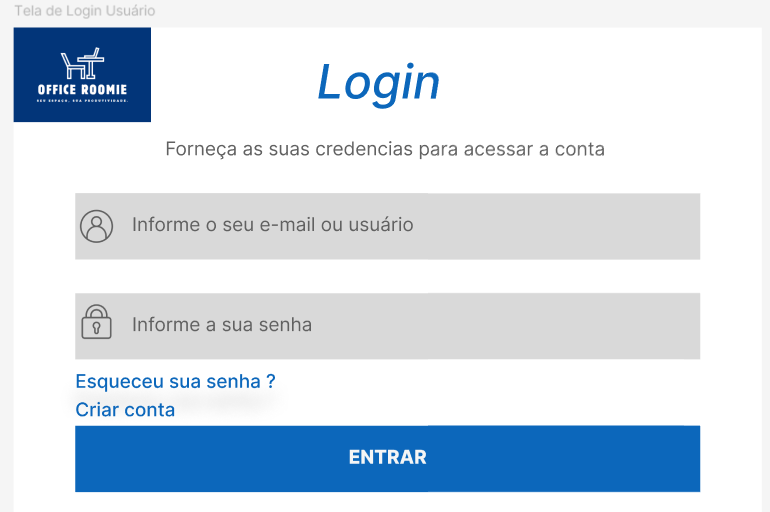
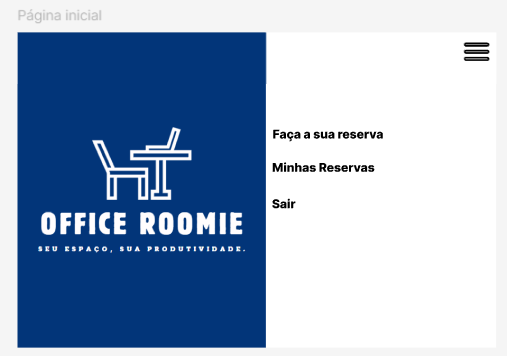
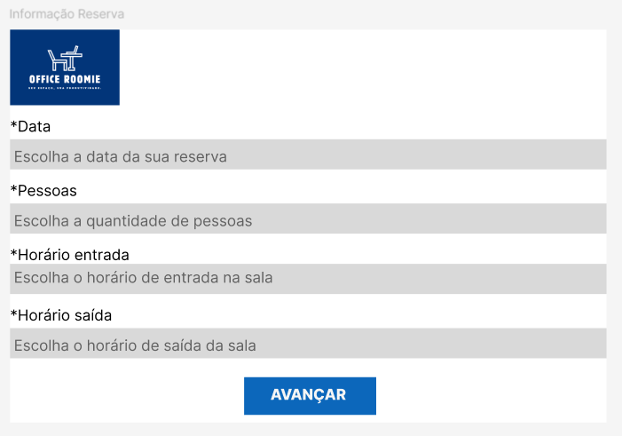
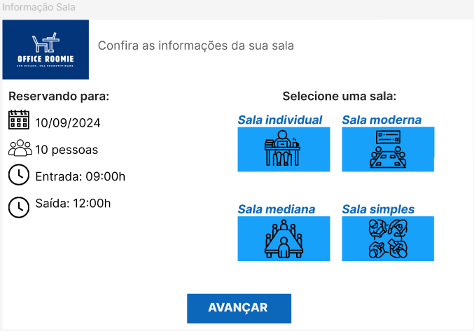
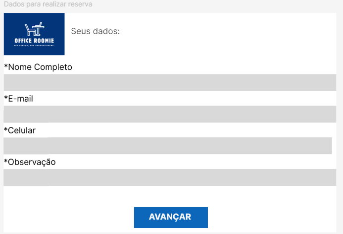
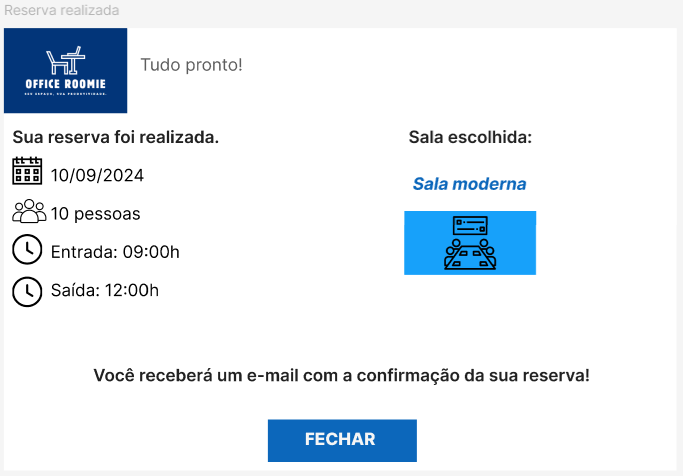
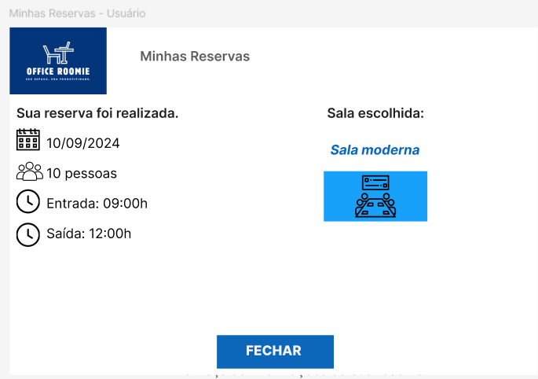
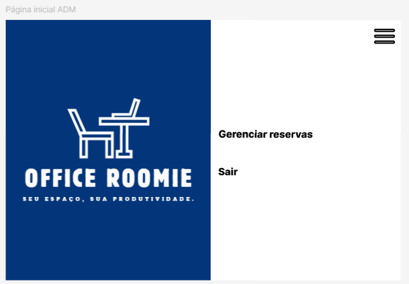
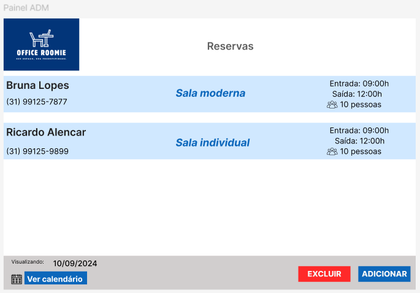

# Projeto de Interface

Pré-requisitos: <a href="2-Especificação do Projeto.md"> Documentação de Especificação</a>

Visão geral da interação do usuário pelas telas do sistema e protótipo interativo das telas com as funcionalidades que fazem parte do sistema (wireframes).

 Apresente as principais interfaces da plataforma. Discuta como ela foi elaborada de forma a atender os requisitos funcionais, não funcionais e histórias de usuário abordados nas <a href="2-Especificação do Projeto.md"> Documentação de Especificação</a>.

## Diagrama de Fluxo

O fluxo do usuário terá início na tela de login, onde após a devida autenticação (com e-mail e senha), o mesmo poderá acessar a home page de acordo com o seu perfil, seja ele de usuário final ou administrador. A página inicial para ambos os perfis permite a visualização das opções/funcionalidades disponíveis para cada um.

Segue abaixo uma visualização do User Flow baseada no relacionamento da página inicial e das telas referentes à cada funcionalidade:

### Diagrama de Fluxo Usuário Final

### Diagrama de Fluxo Administrador

## Wireframes

## Abaixo, segue os Wireframes do app Office Roomie:

### Tela de Login Usuário

### Página Inicial Usuário

### Informação da Reserva

### Informação da Sala

### Dados para realizar a reserva

### Reserva realizada

### Minhas reservas (Usuário)

### Tela de Login ADM

### Página inicial ADM

### Painel ADM

 
> **Links Úteis**:
> - [Protótipos vs Wireframes](https://www.nngroup.com/videos/prototypes-vs-wireframes-ux-projects/)
> - [Ferramentas de Wireframes](https://rockcontent.com/blog/wireframes/)
> - [MarvelApp](https://marvelapp.com/developers/documentation/tutorials/)
> - [Figma](https://www.figma.com/)
> - [Adobe XD](https://www.adobe.com/br/products/xd.html#scroll)
> - [Axure](https://www.axure.com/edu) (Licença Educacional)
> - [InvisionApp](https://www.invisionapp.com/) (Licença Educacional)
