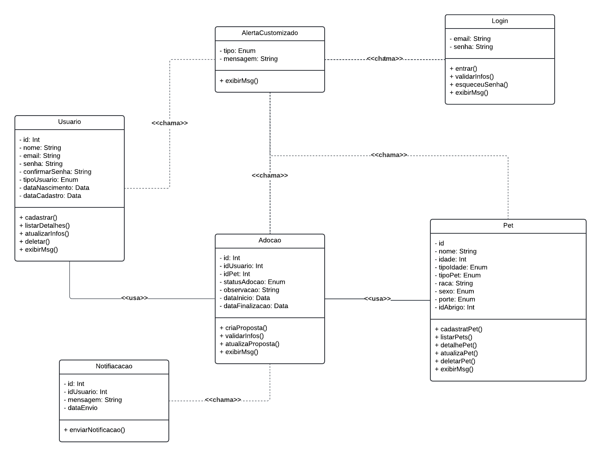

# Arquitetura da Solução

### Classe `Usuario`
Esta classe representa os usuários do sistema, que podem ser adotantes ou abrigos.

- **Atributos:**
  - `id`: Identificador único do usuário.
  - `nome`: Nome do usuário.
  - `email`: Email do usuário.
  - `senha`: Senha para login.
  - `tipo`: Tipo de usuário, que pode ser 'adotante' ou 'abrigo'.
  - `dataNascimento`: Data de nascimento do usuário.
  - `dataCadastro`: Data que foi realizado o cadastro na plataforma.

- **Métodos:**
  - `cadastrar()`: Método para cadastrar um novo usuário no sistema.
  - `listarDetalhes()`: Método para visualizar as informações do usuário.
  - `atualizarInfos()`: Método para atualizar informações do usuário.
  - `deletar()`: Método para deletar a conta do usuário.
  - `exibeMsg()`: Método para exibir as mensagens de acordo com a ação do usuário.

### Classe `Pet`
Esta classe representa os Pets disponíveis para adoção.

- **Atributos:**
  - `id`: Identificador único do pet.
  - `nome`: Nome do pet.
  - `idade`: Idade do pet.
  - `tipoIdade`: Tipo da idade, pode ser dias, meses e anos.
  - `tipoPet`: Tipo do pet'cão','gato', 'Jabuti' e outros.
  - `raca`: Raça do pet.
  - `sexo`: Indicar qual o sexo do pet.
  - `porte`: Indica o porte do pet, pequeno, médio ou grande.
  - `idAbrigo`: Identificador do abrigo (usuário) responsável pelo pet.

- **Métodos:**
  - `cadastrarPet()`: Método para cadastrar um novo pet no sistema.
  - `listarPets`: Lista todos os pets.
  - `DetalhePet`: Lista todos os detalhes de um pet especifico.
  - `atualizarPet()`: Método para editar as informações do pet.
  - `deletarPet()`: Método para deletar o cadastro do pet.
  - `exibeMsg()`: Método para exibir as mensagens de acordo com a ação do usuário.

### Classe `Adocao`
Esta classe representa o interesse de um usuário em adotar um pet.

- **Atributos:**
  - `id`: Identificador único do interesse.
  - `usuario_id`: Identificador do usuário que demonstrou interesse.
  - `pet_id`: Identificador do pet pelo qual o interesse foi demonstrado.
  - `data`: Data em que o interesse foi registrado.

- **Métodos:**
  - `demonstrar()`: Método para registrar o interesse de um usuário em um pet.

### Classe `Notificacao`
Esta classe representa as notificações enviadas aos usuários.

- **Atributos:**
  - `id`: Identificador único da notificação.
  - `usuario_id`: Identificador do usuário que receberá a notificação.
  - `mensagem`: Conteúdo da notificação.
  - `data`: Data em que a notificação foi enviada.

- **Métodos:**
  - `enviar()`: Método para enviar uma notificação ao usuário.
 
## Relacionamentos

1. **Usuario abriga Animal**
   - Tipo: 1:N (um usuário pode abrigar vários animais)

2. **Usuario demonstra Interesse**
   - Tipo: 1:N (um usuário pode ter vários interesses em animais)

3. **Usuario recebe Notificacao**
   - Tipo: 1:N (um usuário pode receber várias notificações)

4. **Animal interessa Interesse**
   - Tipo: 1:N (um animal pode ser de interesse para vários usuários)

## Diagrama de Classes

## Modelo ER (Projeto Conceitual)
O Modelo ER representa através de um diagrama como as entidades (coisas, objetos) se relacionam entre si na aplicação interativa.

Sugestão de ferramentas para geração deste artefato: LucidChart e Draw.io.

A referência abaixo irá auxiliá-lo na geração do artefato “Modelo ER”.

> - [Como fazer um diagrama entidade relacionamento | Lucidchart](https://www.lucidchart.com/pages/pt/como-fazer-um-diagrama-entidade-relacionamento)

## Projeto da Base de Dados

O projeto da base de dados corresponde à representação das entidades e relacionamentos identificadas no Modelo ER, no formato de tabelas, com colunas e chaves primárias/estrangeiras necessárias para representar corretamente as restrições de integridade.
 
Para mais informações, consulte o microfundamento "Modelagem de Dados".

## Tecnologias Utilizadas

## Hospedagem

Explique como a hospedagem e o lançamento da plataforma foi feita.

> **Links Úteis**:
>
> - [Website com GitHub Pages](https://pages.github.com/)
> - [Programação colaborativa com Repl.it](https://repl.it/)
> - [Getting Started with Heroku](https://devcenter.heroku.com/start)
> - [Publicando Seu Site No Heroku](http://pythonclub.com.br/publicando-seu-hello-world-no-heroku.html)
