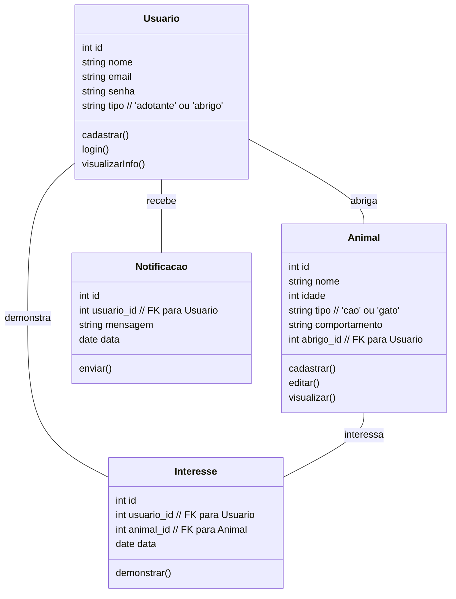
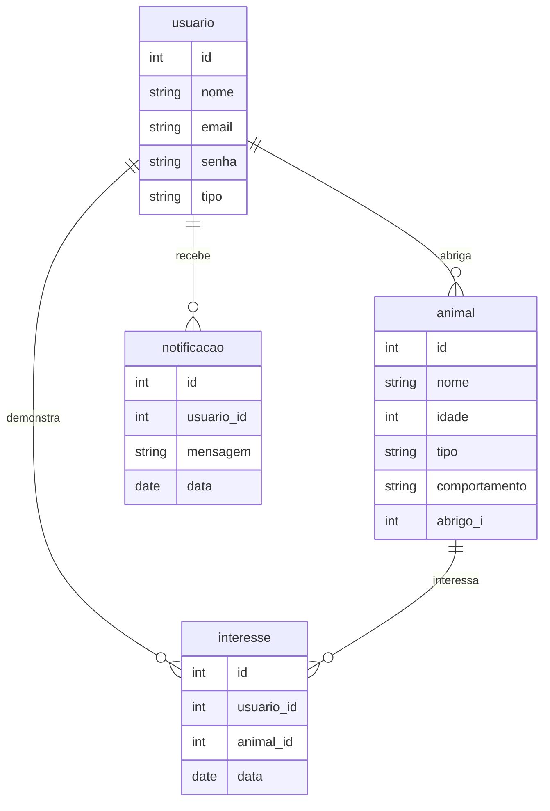

# Arquitetura da Solução

### Classe `Usuario`
Esta classe representa os usuários do sistema, que podem ser adotantes ou abrigos.

- **Atributos:**
  - `id`: Identificador único do usuário.
  - `nome`: Nome do usuário.
  - `email`: Email do usuário.
  - `senha`: Senha para login.
  - `tipo`: Tipo de usuário, que pode ser 'adotante' ou 'abrigo'.

- **Métodos:**
  - `cadastrar()`: Método para cadastrar um novo usuário no sistema.
  - `login()`: Método para realizar o login do usuário.
  - `visualizarInfo()`: Método para visualizar as informações do usuário.

### Classe `Animal`
Esta classe representa os animais disponíveis para adoção.

- **Atributos:**
  - `id`: Identificador único do animal.
  - `nome`: Nome do animal.
  - `idade`: Idade do animal.
  - `tipo`: Tipo do animal'cão','gato',raça,porte
  - `comportamento`: Descrição do comportamento do animal.
  - `abrigo_id`: Identificador do abrigo (usuário) responsável pelo animal.

- **Métodos:**
  - `cadastrar()`: Método para cadastrar um novo animal no sistema.
  - `editar()`: Método para editar as informações do animal.
  - `visualizar()`: Método para visualizar as informações do animal.

### Classe `Interesse`
Esta classe representa o interesse de um usuário em adotar um animal.

- **Atributos:**
  - `id`: Identificador único do interesse.
  - `usuario_id`: Identificador do usuário que demonstrou interesse.
  - `animal_id`: Identificador do animal pelo qual o interesse foi demonstrado.
  - `data`: Data em que o interesse foi registrado.

- **Métodos:**
  - `demonstrar()`: Método para registrar o interesse de um usuário em um animal.

### Classe `Notificacao`
Esta classe representa as notificações enviadas aos usuários.

- **Atributos:**
  - `id`: Identificador único da notificação.
  - `usuario_id`: Identificador do usuário que receberá a notificação.
  - `mensagem`: Conteúdo da notificação.
  - `data`: Data em que a notificação foi enviada.

- **Métodos:**
  - `enviar()`: Método para enviar uma notificação ao usuário.

## Diagrama de Classes

> - [Diagramas de Classes - Documentação da IBM](https://www.ibm.com/docs/pt-br/rational-soft-arch/9.6.1?topic=diagrams-class)
> - [O que é um diagrama de classe UML? | Lucidchart](https://www.lucidchart.com/pages/pt/o-que-e-diagrama-de-classe-uml)

## Modelo ER (Projeto Conceitual)
O Modelo ER representa através de um diagrama como as entidades (coisas, objetos) se relacionam entre si na aplicação interativa.

Sugestão de ferramentas para geração deste artefato: LucidChart e Draw.io.

A referência abaixo irá auxiliá-lo na geração do artefato “Modelo ER”.

> - [Como fazer um diagrama entidade relacionamento | Lucidchart](https://www.lucidchart.com/pages/pt/como-fazer-um-diagrama-entidade-relacionamento)

## Projeto da Base de Dados

O projeto da base de dados corresponde à representação das entidades e relacionamentos identificadas no Modelo ER, no formato de tabelas, com colunas e chaves primárias/estrangeiras necessárias para representar corretamente as restrições de integridade.
 
Para mais informações, consulte o microfundamento "Modelagem de Dados".

## Tecnologias Utilizadas

Descreva aqui qual(is) tecnologias você vai usar para resolver o seu problema, ou seja, implementar a sua solução. Liste todas as tecnologias envolvidas, linguagens a serem utilizadas, serviços web, frameworks, bibliotecas, IDEs de desenvolvimento, e ferramentas.

Apresente também uma figura explicando como as tecnologias estão relacionadas ou como uma interação do usuário com o sistema vai ser conduzida, por onde ela passa até retornar uma resposta ao usuário.

## Hospedagem

Explique como a hospedagem e o lançamento da plataforma foi feita.

> **Links Úteis**:
>
> - [Website com GitHub Pages](https://pages.github.com/)
> - [Programação colaborativa com Repl.it](https://repl.it/)
> - [Getting Started with Heroku](https://devcenter.heroku.com/start)
> - [Publicando Seu Site No Heroku](http://pythonclub.com.br/publicando-seu-hello-world-no-heroku.html)
