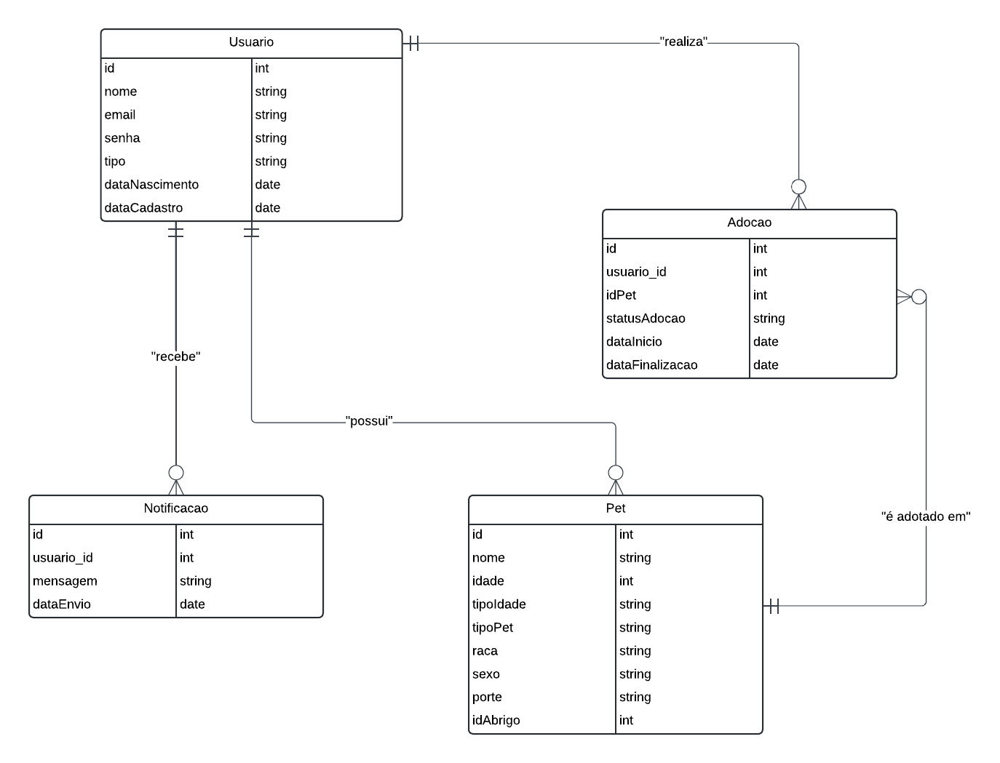

# Arquitetura da Solução

## Diagrama de Classes

### Classe `Usuario`
Esta classe representa os usuários do sistema, que podem ser adotantes ou abrigos.

- **Atributos:**
  - `id`: Identificador único do usuário.
  - `nome`: Nome do usuário.
  - `email`: Email do usuário.
  - `senha`: Senha para login.
  - `tipo`: Tipo de usuário, que pode ser 'adotante' ou 'abrigo'.
  - `dataNascimento`: Data de nascimento do usuário.
  - `dataCadastro`: Data que foi realizado o cadastro na plataforma.

- **Métodos:**
  - `cadastrar()`: Método para cadastrar um novo usuário no sistema.
  - `listarDetalhes()`: Método para visualizar as informações do usuário.
  - `atualizarInfos()`: Método para atualizar informações do usuário.
  - `deletar()`: Método para deletar a conta do usuário.
  - `exibeMsg()`: Método para exibir as mensagens de acordo com a ação do usuário.

### Classe `Pet`
Esta classe representa os Pets disponíveis para adoção.

- **Atributos:**
  - `id`: Identificador único do pet.
  - `nome`: Nome do pet.
  - `idade`: Idade do pet.
  - `tipoIdade`: Tipo da idade, pode ser dias, meses e anos.
  - `tipoPet`: Tipo do pet'cão','gato', 'Jabuti' e outros.
  - `raca`: Raça do pet.
  - `sexo`: Indicar qual o sexo do pet.
  - `porte`: Indica o porte do pet, pequeno, médio ou grande.
  - `idAbrigo`: Identificador do abrigo (usuário) responsável pelo pet.

- **Métodos:**
  - `cadastrarPet()`: Método para cadastrar um novo pet no sistema.
  - `listarPets`: Lista todos os pets.
  - `DetalhePet`: Lista todos os detalhes de um pet especifico.
  - `atualizarPet()`: Método para editar as informações do pet.
  - `deletarPet()`: Método para deletar o cadastro do pet.
  - `exibeMsg()`: Método para exibir as mensagens de acordo com a ação do usuário.

### Classe `Adocao`
Esta classe representa o interesse de um usuário em adotar um pet.

- **Atributos:**
  - `id`: Identificador único do processo de adoção.
  - `usuario_id`: Identificador do usuário que demonstrou interesse.
  - `idPet`: Identificador do pet pelo qual foi iniciado o processo de adoção.
  - `statusAdocao`: Indica o status da adoção que pode ser, iniciado, em andamento, finalizado e cancelado.
  - `dataInicio`: Data em que o processo foi iniciado.
  - `dataFinalizacao`: Data em que o processo foi finalizado.

- **Métodos:**
  - `criarProposta()`: Método para iniciar o processo de adoção.
  - `validarInfos`: Método para validar as informações disponibilizadas.
  - `atualizaProposta`: Método para atualizar informações na proposta iniciada.
  - `exibeMsg()`: Método para exibir as mensagens de acordo com a ação do usuário.

### Classe `Login`
Esta classe representa o login do usuário.

- **Atributos:**
  - `email`: Email do usuário.
  - `senha`: Senha do usuário.

- **Métodos:**
  - `entrar()`: Método para iniciar o processo de login.
  - `validaInfos()`: Método para validar as informações fornecidas no login.
  - `esqueceuSenha()`: Método para iniciar o processo de recuperação da senha.
  - `exibeMsg()`: Método para exibir as mensagens de acordo com a ação do usuário.

### Classe `Notificacao`
Esta classe representa as notificações enviadas aos usuários.

- **Atributos:**
  - `id`: Identificador único da notificação.
  - `usuario_id`: Identificador do usuário que receberá a notificação.
  - `mensagem`: Conteúdo da notificação.
  - `dataEnvio`: Data em que a notificação foi enviada.

- **Métodos:**
  - `enviarNotificacao()`: Método para enviar uma notificação ao usuário.
 
### Classe `AlertaCustomizado`
Esta classe representa as notificações enviadas aos usuários.

- **Atributos:**
  - `tipo`: 
  - `usuario_id`: Identificador do usuário que receberá a notificação.
  - `mensagem`: Conteúdo da notificação.
  - `dataEnvio`: Data em que a notificação foi enviada.

- **Métodos:**
  - `enviarNotificacao()`: Método para enviar uma notificação ao usuário.

## Modelo ER (Projeto Conceitual)
O Modelo ER representa através de um diagrama como as entidades (coisas, objetos) se relacionam entre si na aplicação interativa.

### Relacionamentos:
1. **Tabela Usuario** 
  - Representa os usuários da plataforma. A chave primária é o id, que é único para cada usuário.
1. **Tabela Pet** 
  - Relaciona-se com a tabela Usuario através da chave estrangeira idAbrigo, que referencia o abrigo responsável pelo pet. Quando um abrigo é deletado, os pets relacionados também são deletados devido à regra ON DELETE CASCADE.
1. **Tabela Adocao** 
  - Representa o processo de adoção. Contém as chaves estrangeiras usuario_id (para o usuário que está adotando) e idPet (para o pet sendo adotado). As regras de integridade referencial garantem que se um pet ou usuário for deletado, o processo de adoção relacionado também será.
1. **Tabela Notificacao** 
  - Relaciona-se com Usuario pela chave estrangeira usuario_id, que referencia o usuário que recebe a notificação.

A referência abaixo irá auxiliá-lo na geração do artefato “Modelo ER”.

> - [Como fazer um diagrama entidade relacionamento | Lucidchart](https://www.lucidchart.com/pages/pt/como-fazer-um-diagrama-entidade-relacionamento)

## Projeto da Base de Dados

O projeto da base de dados corresponde à representação das entidades e relacionamentos identificadas no Modelo ER, no formato de tabelas, com colunas e chaves primárias/estrangeiras necessárias para representar corretamente as restrições de integridade.
 
Para mais informações, consulte o microfundamento "Modelagem de Dados".

## Tecnologias Utilizadas

## Hospedagem

Explique como a hospedagem e o lançamento da plataforma foi feita.

> **Links Úteis**:
>
> - [Website com GitHub Pages](https://pages.github.com/)
> - [Programação colaborativa com Repl.it](https://repl.it/)
> - [Getting Started with Heroku](https://devcenter.heroku.com/start)
> - [Publicando Seu Site No Heroku](http://pythonclub.com.br/publicando-seu-hello-world-no-heroku.html)
