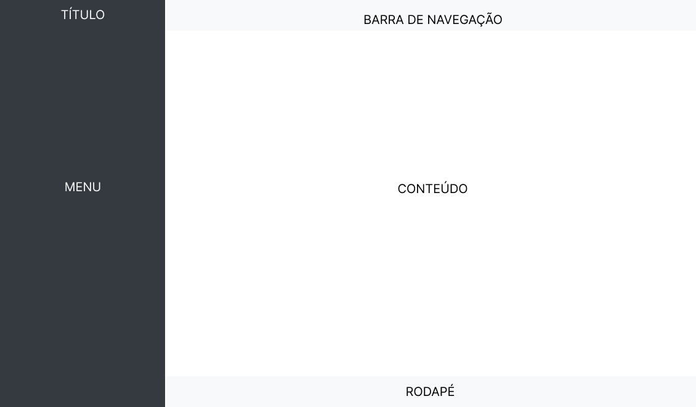
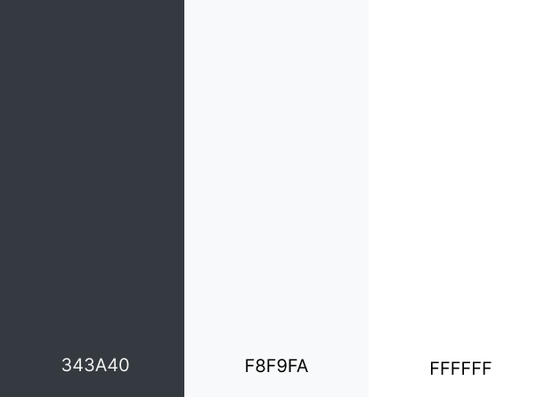

# Template Padrão da Aplicação 
O template apresentado a seguir foi desenvolvido para fornecer uma estrutura visual coerente e consistente ao sistema de reservas de salas para coworking. Ele organiza a interface gráfica em seções principais, facilitando a navegação e a experiência do usuário.

*Template*

### O template é organizado com base nos seguintes componentes:

#### 1. Título: 
Localizado na barra lateral fixa (esquerda), contém o nome ou logo da aplicação, proporcionando fácil identificação do sistema.
#### 2. Menu: 
Também situado na barra lateral fixa, o menu oferece opções de navegação que permitem ao usuário acessar as diferentes funcionalidades do sistema, como reservar uma sala, consultar reservas, ou gerenciar dados do perfil.
Esse menu é visível o tempo todo, facilitando o acesso rápido às funções mais importantes.
#### 3. Barra de Navegação: 
Localizada na parte superior da página, a barra de navegação pode conter atalhos, opções de usuário (como configurações e logout), e outros elementos contextuais, dependendo da página ativa.
Ela oferece uma navegação complementar às opções do menu lateral.
#### 4. Conteúdo: 
Esta seção ocupa a maior parte da tela e exibe o conteúdo específico de cada funcionalidade, como a lista de salas disponíveis, detalhes de uma reserva, ou formulários de cadastro.
A área é dinâmica, adaptando-se ao conteúdo necessário em cada momento.
#### 5. Rodapé: 
O rodapé, posicionado na base da página, pode conter informações institucionais, links úteis ou direitos autorais da aplicação.

### Princípios de Design
#### O template foi desenhado com os seguintes princípios:

#### Clareza Visual: 
As seções são bem definidas, facilitando a navegação intuitiva.
#### Responsividade: 
O layout se adapta a diferentes tamanhos de tela, garantindo uma boa experiência tanto em dispositivos móveis quanto em desktops.
#### Consistência: 
O uso de cores, tipografia e espaçamento é padronizado para garantir uma identidade visual forte e coesa em toda a aplicação.
#### Foco no Usuário: 
O sistema prioriza a facilidade de uso, proporcionando uma jornada clara desde a escolha da sala até a confirmação da reserva.

### Paleta de Cores
A paleta de cores foi projetada para garantir uma interface limpa, moderna e intuitiva no sistema de reserva de salas. As cores selecionadas são:

#### #343A40 (Cinza Escuro): 
Usada principalmente para textos e elementos que precisam de destaque em fundo claro. O cinza escuro traz seriedade e facilita a leitura, além de oferecer contraste sem ser agressivo como o preto puro.

#### #F8F9FA (Cinza Claro): 
Um tom suave de cinza que serve como o fundo principal, proporcionando uma aparência leve e moderna, sem distrair o usuário. Ele dá um aspecto "clean" ao sistema, contribuindo para uma experiência visual agradável.

#### #FFFFFF (Branco): 
Utilizado para áreas de destaque, como caixas de input, e elementos que demandam maior foco. O branco mantém a simplicidade e ajuda a destacar os elementos interativos na interface.

Essa combinação de cores foi escolhida para proporcionar um ambiente de trabalho profissional, minimizando distrações visuais e melhorando a experiência do usuário na navegação e utilização do sistema.

*Paleta de cores*

<!-- Pré-requisitos: <a href="2-Especificação do Projeto.md"> Especificação do Projeto</a>, <a href="3-Projeto de Interface.md"> Projeto de Interface</a>, <a href="4-Metodologia.md"> Metodologia</a>

Layout padrão da aplicação que será utilizado em todas as páginas com a definição de identidade visual, aspectos de responsividade e iconografia.

> **Links Úteis**:
>
> - [CSS Website Layout (W3Schools)](https://www.w3schools.com/css/css_website_layout.asp)
> - [Website Page Layouts](http://www.cellbiol.com/bioinformatics_web_development/chapter-3-your-first-web-page-learning-html-and-css/website-page-layouts/)
> - [Perfect Liquid Layout](https://matthewjamestaylor.com/perfect-liquid-layouts)
> - [How and Why Icons Improve Your Web Design](https://usabilla.com/blog/how-and-why-icons-improve-you-web-design/) -->
